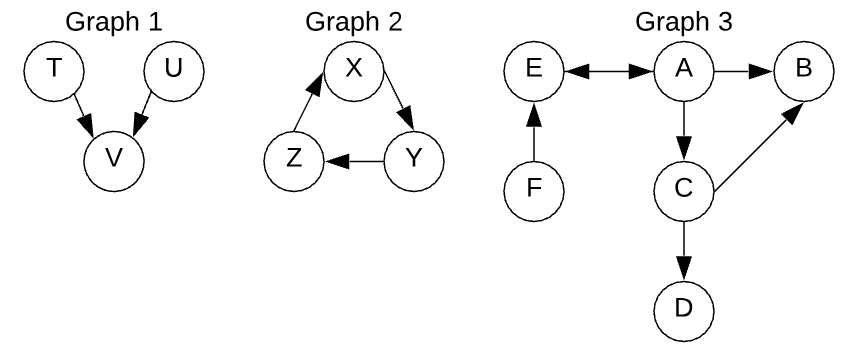

# S1W12D1

---

## [Array.sort()](https://developer.mozilla.org/en-US/docs/Web/JavaScript/Reference/Global_Objects/Array/sort)

- [TimSort](https://dev.to/jennieji/tim-sort-the-fastest-sort-used-in-v8-and-python-5e76)

## Graphs

### What is a graph?

**...EVERYTHING!**

- Linked Lists
- Trees
- Anything with a node and a pointer!

### Graph Vocabulary

- Vertex: A node in the graph. Vertex and node can be used interchangeably
- Directed edge: A one-way connection from one vertex to another
- Undirected edge/Bidirectional edge: A two-way connection between two vertices
  that can be traversed in either direction
- Edge weight: The cost of traversing an edge. (This would be equivlent to the
  lines/edges in the whole graph having lengths)
- Cyclic/acyclic: A cyclic graph is a graph with at least 1 cycle, or the
  potential to have a cycle

---

### Adjacency Lists



```js
const graph1 = {
  T: ['V'],
  U: ['V'],
  V: [],
};

const graph2 = {
  X: ['Y'],
  Y: ['Z'],
  Z: ['X'],
};

const graph3 = {
  A: ['B', 'C', 'E'],
  B: [],
  C: ['B', 'D'],
  D: [],
  E: ['A'],
  F: ['E'],
};
```


```js
//an undirected graph may look like this:
const undirected = {
  1: [2, 5],
  2: [1, 3, 5],
  3: [2, 4],
  4: [3, 5, 6],
  5: [1, 2, 4],
  6: [4],
};
```

---

## Traversing Graphs (Example Patterns)

### BFS

1. Create a queue and enqueue the starting node
2. Create a set to store visited nodes
3. While the queue is not empty, repeat steps 4-6
4. Dequeue the first node
5. Logic with dequeued node
6. For each unvisited neighbor, add it to the visited nodes and to the back of
   the queue

### DFS

1. Create a stack and push the starting node
2. Create a set to store visited nodes, and add the starting node
3. While the stack is not empty, repeat steps 4-6
4. Pop the node on the top of the stack
5. Logic for popped node
6. For each unvisited neighbor, add it to the visited nodes and to the top
   of the stack