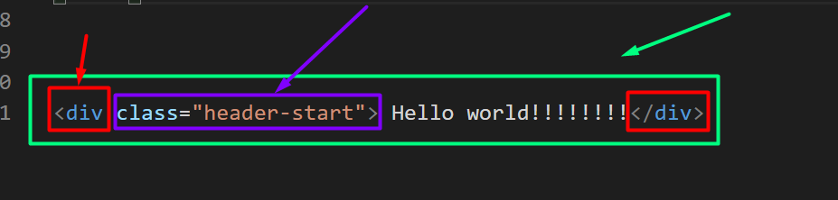

# S1W13D2

## Helpful Tools

- [Live Server](https://marketplace.visualstudio.com/items?itemName=ritwickdey.LiveServer)

- [Emmet](https://docs.emmet.io/cheat-sheet/)

- [Wireframing](https://wireframe.cc/)

## Website Building Blocks

- HTML: Provides structure and layout
- CSS: Provides look, feel, and positioning
- JavaScript: Provides interactivity and complex functionality

You can think of a webpage like a house 
  - HTML is the frame, rooms, and foundations
  - CSS is the paint, flooring and finished surfaces
  - JavaScript is the plumbing, electrical wiring and internet connection

**Today** we will be focusing on pure HTML

**Tomorrow** we will start adding in CSS

**Later** we will reintroduce JavaScript in the context of the browser

- Green - Element
- Red - Opening/Closing Tags
- Purple - Attribute
