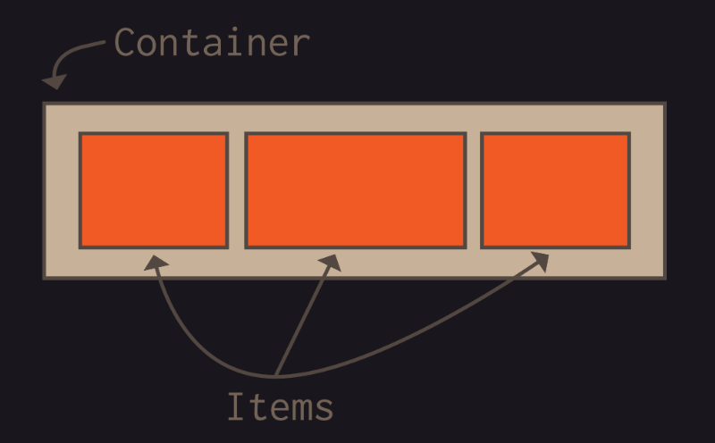
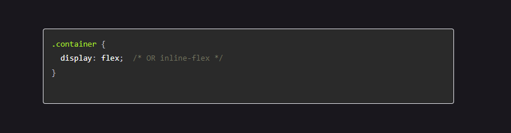
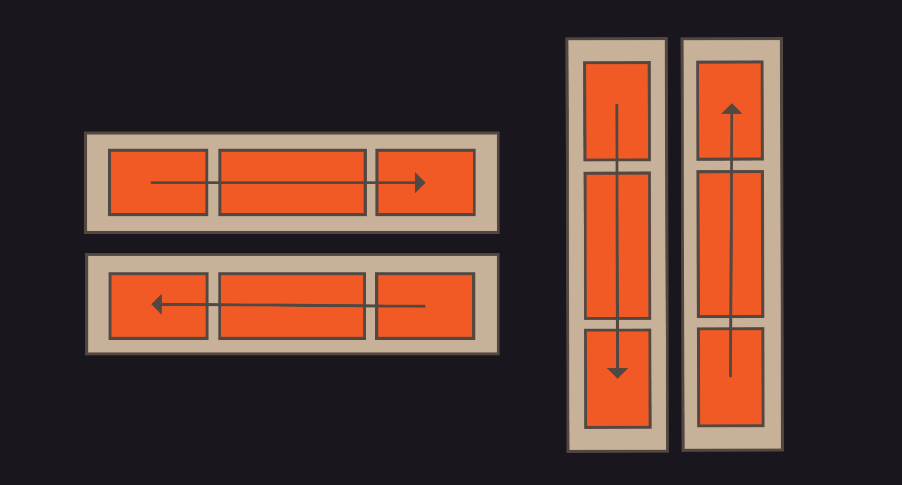
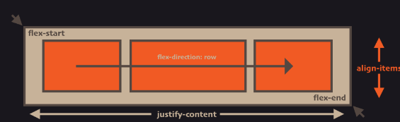
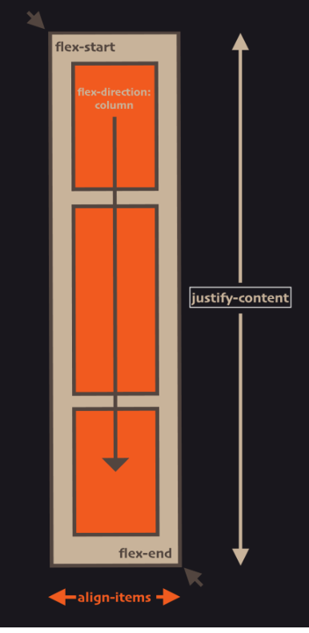

# Flex Box Model

### Container based design approach
 - Think of using the flex box model as defining how the container will arrange the items within it.
 - Modern way of displaying and organizing html. Can dynamically size and align contents within the container.



### Set up a container to be a flex box container

- In order to make a parent element flex box container set the display property to flex.


### Flex wrap and flex direction

- default settings for a flex container will have flex items on a single line regardless of container size. It will allow items to bleed out of container.

- flex direction determines the direction the flex items will be laid out. There are 2 different options, row and column



### Flex alignment - justify-content and align-items

- With the flex box model, we can control the alignment and spacing of the flex items using the justify-content and align-items properties.

#### justify-content
Defines the alignment of flex items along the main axis, and distributes extra container space around/between items.
- flex-start: keeps items their original size and stacks them all at the start.
- flex-end: like flex-start with sizing, but it stacks the flex-items to the end of the container.
- center: stacks all items in the center.
- space-between: spaces items evenly between each item.
- space-around: Keep items their designated size and put space at the start, at the end, and in between.
- stretch: grow or shrink items to fill all the space.

#### align-items
Defines the alignment of flex items along the cross axis, and distributes extra container space around/between items.

shares same options as justify-content

- flex-start
- flex-end
- center
- stretch

#### gap
gap lets us control the amount of spacing in between each item.

#### flex-direction in relation to justify-content and align-items
When flex-direction is set to row, justify-content sets items horizontally across the x-axis while align-items takes care of vertical placement along the y-axis.



If flex-direction is set to column then they justify-content will set along the y-axis and align-items will set along the x-axis.



### media queries

- Grants ability to dynamically adjust styling depending on various factors. Most commonly used to display websites differently depnding on screen size.

```css
    @media screen and (min-width: 500px){
        styles go here when the viewport is at least 500px
    }
```
