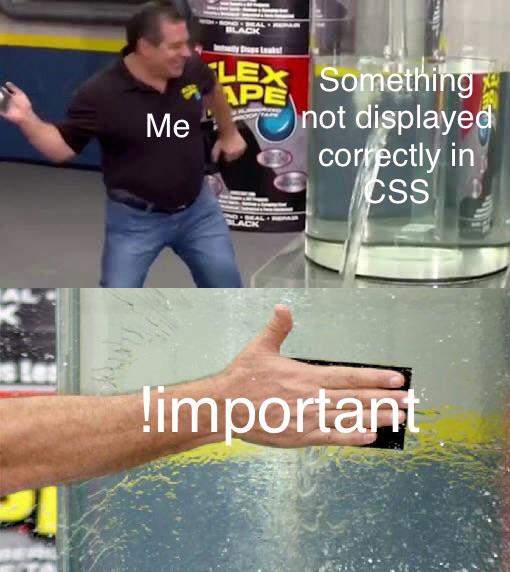

# `S1W14D4`

## `!important`

- Gives more weight to a certain property, overriding all previous styling rules for
that specific property
- Can be useful when the desire is to have an specific element look a certain way,
regardless of other stylings (utility classes)
- Should be used sparingly as it acts more like a band-aid

## [`Normalize CSS`](https://github.com/necolas/normalize.css)

- Every browser has their own default styles defined in the `user agent stylesheet`
- In order to standardize styles across browsers, a `reset.css` or `normalize.css` should
be inserted as the first stylesheet rendered

## `CSS Frameworks`

- Pre-built `CSS` libraries that include styling for UI elements
- Can be simple and lightweight or heavy-duty and opinionated
- Opinionated frameworks come with more features and functionality
  - Downside is that your app is going to look like every other app using that library

### `Popular Frameworks`

- [Bootstrap](https://getbootstrap.com/docs/5.0/getting-started/introduction/)
  - most popular CSS framework
  - dev'd by Twitter in 2011
  - 12 col grid, rounded buttons, universal style
  - also provides `JS` feature for **interactivity**
- [Pure CSS](https://purecss.io/layouts/)
  - lightweight and un-opinionated
  - dev'd by Yahoo in 2013
  - contains *purely* `CSS`, no `JS`
- [Material UI](https://materializecss.com/)
  - comprehensive design system
  - dev'd by Google
  - Highly Opinionated
  - [Material Design Docs](https://material.io/design/introduction) are great to learn the basics of design.
  - includes react components!
- [Tailwind](https://tailwindcss.com/docs/installation)
  - utility-first
  - dev'd in 2017
  - un-opinionated
  - not as robust as some others
  - highly customizable

## `Grid`

[Must watch](https://www.youtube.com/watch?v=3elGSZSWTbM)

### Flex
- If you want the layout to adapt to the content
- One dimensional (orientation based on a main axis)
- Navbars, card layouts

### Grid
- If you want the content to adapt to the layout
- Two dimensional (orientation based on two axises)
- eg calendars, newspaper-style layouts, photo collages
