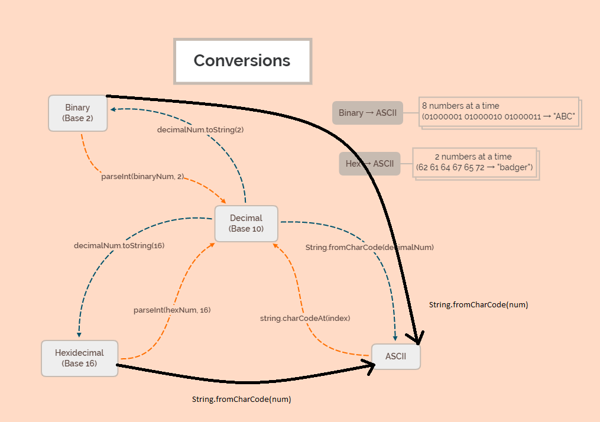

# S1W9D4

## Memory

### RAM

- What does it hold?
  - bits, 1s and 0s, in the form of electrical charge
- Is it slow or fast?
  - fast, to read and write
- Persistent or volatile?
  - volatile - HDDs and SSDs are for long-term storage
  - needs a constant electric power source to retain information
- Cheap or expensive compared to hard disk storage?
  - expensive
- How do we access or refer to it?
  - memory addresses, pointers, references

## Arrays

- **most time and space efficient way to store data**
  - **sequence of elements stored in a *contiguous block of memory*** 
  - Packed side-to-side with no wasted memory 
  - Can also *pre-allocate memory* for an array to avoid having to resize it later (which is a Linear O(n) operation) 
    - Use the `Array constructor`

```js
var numObjects = 10;
var myArray = new Array(3*numObjects);
// allocates 30 spaces in memory for this new empty array that's been created
```

- Allow us to access elements through `indexing`
- Want the element at index 5? Move the pointer to the correct location and read the data 
    - Indexing an array is a **Constant O(1) operation**
    - Since the indices are numerical, the array must be stored in an **ordered sequence of memory addresses**

## Stacks

A stack is an *abstract data type* (ADT) that stores a collection of data

- LIFO
  - Add = push
  - Remove = pop
- Implemented with an array under the hood eg. `const stack = [];` and push and pop elements on that array
- Browser history, undo/redo
- *Time complexity*
  - *If memory has been allocated* for the array then adding and removing elements and also checking the size of the stack will be a **Constant O(1) operation** 
  - *If not*, it could be a **Linear O(n)** operation in the worst case scenario
- *Space complexity* of a stack is **Linear O(n)**, because we need `n` array slots to store `n` variables

### **Quick note on Recursion**

- **Minimum space complexity of Linear O(n)**
  - If space is an issue, and your input is large, it's usually better to use an iterative solution

## Binary Logic


When we write code, it's first translated into simplified machine instructions (binary) then loaded into memory, then it's executed by the processor.

## Different Number bases

### Base-10 Decimal

You learned to count in a base 10 system. All numbers are based on a 0-9
counting pattern.
0, 1, 2, 3, 4, 5, 6, 7, 8, 9....

- when you get to the last digit, you simply increase the number to the left and
 start over from 0

```js
00
01
02
03
04
05
06
07
08
09
10
11
12
```

### Base-2 Binary

2 Key points:
  - binary is all 0s and 1s
  - binary digits are called bits
    - a group of 8 bits is a byte

```js
  B   D
0000 (0)
0001 (1)
0010 (2)
0011 (3)
0100 (4)
0101 (5)
0110 (6)
0111 (7)
1000 (8)
```

- The pattern is: 0 and 1 are the same a base 10, but then you run out of digits.
  - The right most digit returns to 0 and the digit to the left increments by 1
- '0b' prefix identifies string/num as binary:  0b0100 -> 4
- Avoids confusion, 8 -> 0b1000 to differentiate from base 10 number 1000

### Translating from binary to decimal

Formula: Multiply each digit by the number base raised to the nth power, where n
is its position _starting from the right_. Then, add all of the results together.

To convert 0b11001010 to decimal, remember the base is 2:

```
2^0 * 0 = 0
2^1 * 1 = 2
2^2 * 0 = 0
2^3 * 1 = 8
2^4 * 0 = 0
2^5 * 0 = 0
2^6 * 1 = 64
2^7 * 1 = 128
```

Add all of those sums together to get 2 + 8 + 64 + 128 = 202

### Hexadecimal

Counting follows this pattern:
The digits are 0-9 with A, B, C, D, E and F representing 10, 11, 12, 13, 14 and
15, respectively. Hexadecimal numbers (sometimes called 'hex' for short) are
prepended with an '0x' to differentiate them as base-16.

- Hexadecimal is often used as shorthand for representing binary values:
  - one hex digit can represent four bits.

```js
 D     B       H
 0 = 0b0000 = 0x0
 1 = 0b0001 = 0x1
 2 = 0b0010 = 0x2
 3 = 0b0011 = 0x3
 4 = 0b0100 = 0x4
 5 = 0b0101 = 0x5
 6 = 0b0110 = 0x6
 7 = 0b0111 = 0x7
 8 = 0b1000 = 0x8
 9 = 0b1001 = 0x9
10 = 0b1010 = 0xA
11 = 0b1011 = 0xB
12 = 0b1100 = 0xC
13 = 0b1101 = 0xD
14 = 0b1110 = 0xE
15 = 0b1111 = 0xF
```

You can use the same formula to translate to decimal from hexadecimal, but you'll use 16 as your base instead of 2.

To convert 0xA1:
```
16^0 *1      =   1 *  1  = 1
16^1 *A (10) =   16 * 10 = 160
```

160 + 1 = 161

To convert the hex number 0xF23C:
```
16^0 *C =    1 * 12 = 12
16^1 *3 =   16 *  3 = 48
16^2 *2 =  256 *  2 = 512
16^3 *F = 4096 * 15 = 61440
```

Add the sums together to get 61440 + 512 + 48 + 12 = 62012

---

### Bytes, kilobytes, megabytes, gigabytes, terabytes

1 byte = 8 bits

#### Recall from grade school

```
kilo  - thousand
mega  - million
giga  - billion
tera  - trillion
peta  - quadrillion
exa   - quintillion
zetta - sextillion
yotta - septillion
```

---

### Letters in Binary


## ASCII:

-   `String.fromCharCode()`

```javascript
console.log(String.fromCharCode(65)); // = A;
console.log(String.fromCharCode(66)); // = B;
console.log(String.fromCharCode(67)); // = C;
```

-   `String.prototype.charCodeAt()`

```javascript
const str = 'ABC';
console.log(str.charCodeAt(0)); // 65 => A;
console.log(str.charCodeAt(1)); // 66 => B;
console.log(str.charCodeAt(2)); // 67 => C;
```

## More Built in JavaScript Conversion Methods:

```javascript
// Convert Hexadecimal to Base10 & back`
let num = parseInt('0xa1', 16); // 161
let str = num.toString(16); // 'a1'
```

