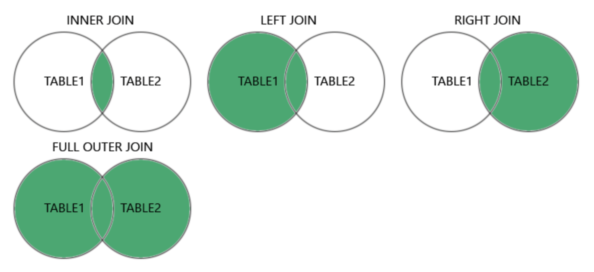

# `S2W20D4`

## JOIN related tables

JOIN allows us to get data from tables through foreign keys

Without JOIN, a FK is not enough to grab data from another table

```sql
--- syntax
SELECT either_table_name.column_name FROM first_table_name
JOIN second_table_name ON (first_table_name.fk_name = second_table_name.pk);
```

Technically, this can be done in any order, but it's best practice to join "logically"

- If a table has a FK, start the join there.
  - Since we have a reference to another table, it makes sense to use that as our "starting" point

## One-to-many JOIN

```sql
CREATE TABLE trees (
  id INTEGER PRIMARY KEY AUTOINCREMENT,
  tree_type VARCHAR(50),
  location VARCHAR(255)
);

CREATE TABLE leaves (
  id INTEGER PRIMARY KEY AUTOINCREMNT,
  color VARCHAR(50),
  leaf_type VARCHAR(255),
  tree_id INTEGER,
  FOREIGN KEY (tree_id) REFERENCES trees(id)
);

SELECT trees.tree_type, leaves.leaf_type FROM leaves
JOIN trees ON (leaves.tree_id = trees.id);
```

## Many-to-many JOIN

```sql
CREATE TABLE elden_ring_players (
  id INTEGER PRIMARY KEY AUTOINCREMENT,
  level INTEGER,
  class VARCHAR(50)
);

CREATE TABLE weapons (
  id INTEGER PRIMARY KEY AUTOINCREMENT,
  type VARCHAR(50),
  damage INTEGER
);

CREATE TABLE player_weapon (
  player_id INTEGER,
  weapon_id INTEGER,
  FOREIGN KEY (player_id) REFERENCES elden_ring_players(id)
  FOREIGN KEY (weapon_id) REFERENCES weapons(id)
);

SELECT elden_ring_players.level, weapons.damage FROM player_weapon
JOIN elden_ring_players ON (
  player_weapon.player_id = players.id
)
JOIN weapons ON (
  player_weapon.weapon_id = weapons.id
);
```

## JOIN: Inner vs Left vs Right

The vast majority of the time, you want to Inner JOIN, this is the default join

The "left" table is the table that comes after `FROM`

The "right" table is the table that comes after `JOIN`

Think: left is first, right is second

`JOIN`

- Both tables must have a valid value to display an output

`LEFT JOIN`

- Only the left/first table must have a valid value to display an output

`RIGHT JOIN`

- Only the right/second table must have a valid value to display an output
  - *Not supported by Sqlite3*

`LEFT` and `RIGHT` are interchangeable, just flip the order of the tables in your query


*Source: w3schools.com*