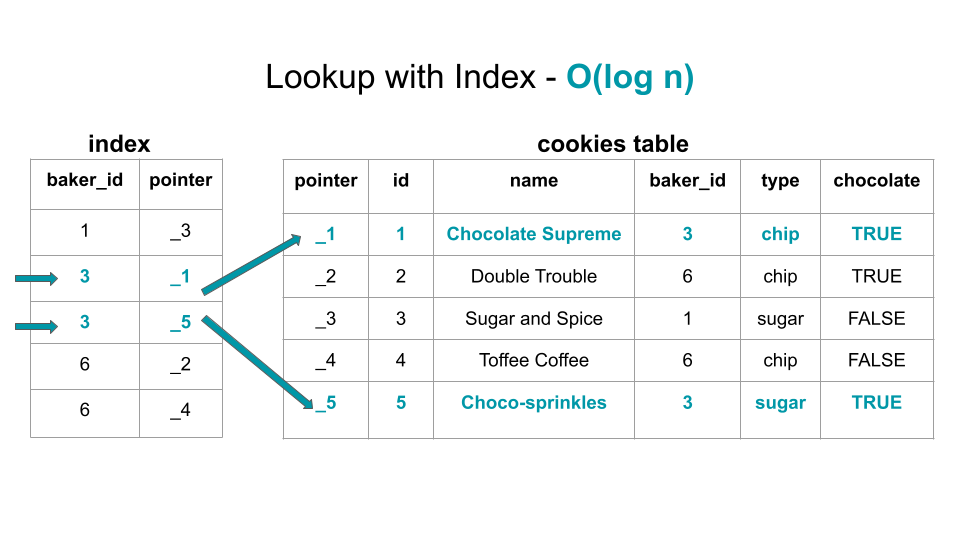

# `S2W21D2`

## SQL Indexes

### Explanation
- A SQL index makes searching for rows in a table by column values faster when your table has many rows / data records.
- A common example is a PRIMARY KEY
- Assigning a UNIQUE constraint on a column is another example of creating an SQL index.

### How does it work
SQL uses a B-tree, similar to a binary search tree, to store data. When creating an indexed column the values will be sorted and paired with a pointer that references the database row that matches the indexed column's value. Since the values become sorted the lookup is O(log n) time, becuase every record does not need to be searched.



### When to create indexes / drawbacks
- Indexing can increase efficiency for lookups, but decrease efficiency for insertion and deletion. 
- Creating an index increases insertion and deletion from O(1) to O(log n).
- It is best to use indexing on columns that will have more lookup operations than insertion / deletion

### Creating an index with raw SQL
```
CREATE INDEX index_name ON table_name(column_list);
```

### UNIQUE
- Adding a unique constraint automatically creates an index on a table
- You can add UNIQUE across several columns to restrict the data combinations across those columns. An example of this syntax:
```
CREATE UNIQUE INDEX index_name ON table_name(col1, col2, col3);
```

### Removing an index
You can remove an index with the following syntax:
```
DROP INDEX column_name;
```

---

## SQL Injections

### What is a SQL injection?
An SQL injection is when a user replaces a DYNAMIC VALUE in a SQL statement with SQL code, with harmful intent.

An example:
```
app.get('/spots', (req, res) => {
    // Get user input from request body
    const { input } = req.body;        
    // "'spotName'; DROP TABLE spots" is the user input

    // Database query
    let query = `SELECT * FROM spots WHERE title = ${input}`;
    // `SELECT * FROM spots WHERE title = 'spotName'; DROP TABLE spots`
    
    // Execute query
    // ...
})

```

In the example above the user sent a SQL query as their input. Without protection this would run in the database and drop the spots table from the database.

### How to avoid an SQL injection
You can avoid SQL injections by 'sanitizing' your dynamic SQL statements before they get executed. This can be very intensive if using just SQL. With the use of some ORMs you have built in protection against SQL injections.

---

## Writing SQL Using Javascript and Sequelize ORM!

## Sequelize has three major file types
- Models
- Migrations
- Seeders

---

## ORM (Object Relational Mapping / Mapper)
**Object Relational Mapping**: is a technique that allows programmers to work with data in a relational database (such as a SQL database) using an object-oriented approach.
- instances of an object in your code
which are mapped directly to rows of data in the database table.

**Mapper**: Library called Sequelize to work with your data directly using the JavaScript language, through a concept called Object Relational Mapping (ORM).
- Using JavaScript and OOP to write JavaScript logic, and manipulate our database, instead of SQL

## Database Model 

A 'model' for the data in our tables

JS Classes were the 'blueprints', and an instance was the 'building'

```js
class Dog {
  // this is the blueprint to make dogs
  constructor(name, age) {
    this.name = name;
    this.age = age;
    this.isGoodDog = true;
  }
}

const guardDog = new Dog('Cerberus', 1000); // an instance of the Dog class
```

Models are JS Classes as well! Every instance is a row in our table

```js
class Dog extends Model {
  static associate(models) {
    // how we create relationships between tables
  }
}

Dog.init(
  // this is basically the constructor
  {
    name: DataTypes.STRING,
    age: DataTypes.INTEGER,
    isGoodDog: {
      type: DataTypes.BOOLEAN,
      defaultValue: true,
    },
  }
);
```

Later we'll learn to create rows in our table using Sequelize syntax instead of saying `new Dog()`. (we will also learn how to create, read, update, delete data - CRUD)

For now, think of models as the blueprint or API that allows us to interact with the data / rows within our database.

---

## Migrations == Mutations 🦠

Any change to our database schema, including creating it!
- **makes and keeps track of changes in our schema (schema = structure of our database w/ all tables and its relationships**: JS File that defines a specific change within our database schema (i.e. maybe a change in a table, etc.).

Sequelize automatically generates migration files based on your models

- This makes migrations act as a version-control system
- Any change you make can be logged and reverted


**Examples:**
- **`adding new table:`** if you are starting a **new project**, you would run a **migration to create a new database table**. 
- **`changing existing column:`** If you have an **existing project**, you might need to **run a migration to make a small change to a table, such as adding a new column**.

- ---

## Plant Data With Seeds 🌱
Think of it as **dummy data**. Seeder files are used to populate the database tables with sample data, or update the sample data as migrations are run. 