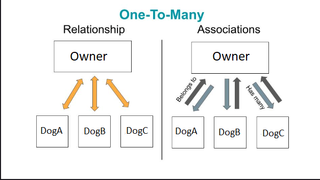

# Foreign Key Column migrations
## How to create foreign keys in sequelize migrations
- In order to add a foreign key to a table in migration, you need to add a references property.
    - The reference property will have a value of an object with 2 properties.
        - a model property that needs to be a string of the table we are trying to reference.
        - a key property which is the column we are using as the "foreign key".
    - We can also add an onDelete property to the column definition as well.
    - An example of 2 migrations for an owner that has many dogs (ONE TO MANY relation).

    ```js
    // user migration

    queryInterface.createTable('Owners', {
    id: {
        type: Sequelize.INTEGER,
        primaryKey: true
    },
    name:{
        type: Sequelize.STRING
    }
    })
    ```

    ```js
    // dogs migration
    queryInterface.createTable('Dogs', {
    id: {
        type: Sequelize.INTEGER,
        primaryKey: true
    },
    name:{
        type: Sequelize.STRING
    },
    age: {
        type: Sequelize.STRING
    }
    ownerId:{
        type: Sequelize.INTEGER,
        references:{
            model: 'Owners', // although it says model here, it is looking for the table name.
            key: 'id' // what column we are referencing in the users table.
        },
        onDelete: 'CASCADE'
    }
    })

    ```
## Join table migrations
- In order to create a many to many relationship between 2 tables, we must have 3 models/migrations in total. The first 2 will create the 2 tables/models, and the third will create the join table/model.
- In this migration we will have 2 columns that will be our foreign keys that reference the Dogs and Toys tables.
- In this example, lets assume we have a Dog model/table and a Toy model/table created. This migration will be run after the 2 migrations for the Dogs and the Toys tables.

```js

    queryInterface.createTable('DogToys', {
    id: {
        type: Sequelize.INTEGER,
        primaryKey: true
    },
    dogId:{
        type: Sequelize.INTEGER,
        references:{
            model: 'Dogs',
            key: 'id'
        }
    }
    toy:Id:{
        type: Sequelize.Integer,
        references:{
            model: 'Toys',
            key: 'id'
        }
    }
    })

```

# Associations and Relations
- relations between 2 tables go both ways and is the relation on a database level.
- An association is on a model level and can either go one way or both ways between the tables.
- If you want to, you don't have to define associations on both sides of a one-to-many association. The side you decide to define the associations on is the side that will have access to the generated association methods.



## Defining associations between tables in sequelize
- every model generated by sequelize will have a static associate method
- in this method we will define our associations with other models. The method accesses other models through the `models` parameter.
    ### Model association methods
    - Model.hasOne
    - Model.hasMany
    - Model.belongsTo
    - Model.belongsToMany

    - Each method will take in 2 arguements.
        - arg1 is the model we are associating with.
        - arg2 is and object that defines properties of the association
        - example showing the Owner model has many Dogs.
    ```js
    // in /models/owner.js
    static associate(models) {
        Owner.hasMany(
            models.Dog,
            { foreignKey : 'ownerId', onDelete: 'CASCADE', hooks:true }
            )
        }
    ```
    - on the Dog model, we can also define the association to belonging to a band.

    ```js
    // in /models/dog.js
    static associate(models) {
      Dog.belongsTo(
        models.Owner,
        { foreignKey: 'ownerId' }
      )
    }
    ```
    ### Using Model associations
    - With our example above, we created a one to many association on the model level.
    - When we create this associations on top of creating migrations with the correct foreign keys / references, we can utilize special methods that sequelize generate for us. These methods make interacting with our database relations much easier.
    - These methods follow specific naming convention when created.
    ```js
        Model.get<<Associated-Model-Name>>(s)
    ```
    - the following method will query for the related data to the model.
    - Methods from our Owner.hasMany dogs association.
        ```js
            // query for an instance of owner from our db
            const owner = await Owner.findByPk(id);
            const dogs = await owner.getDogs(); // Will get all dogs associated to this owner.
            const newDog = await owner.createDog({name:"Bea", "age" : 16});  // pass in object to match columns to create a dog.
        ```
        - When we create a new Dog like this through the owner, the foreign key (ownerId) is automatically set to the owner we queried for.

    - Methods from out Dog.belongsTo owner association.
        ```js
         // query for the dog first
        const dog = await dog.findByPk(id);

        await dog.getOwner(); // Will get the owner the dog is associated with.

        // Create a new Dog
        const newDog = await Dog.create({name : "gigi", "age" : 15});
        // Create an owner for the new dog.
        dog.createOwner({name : "Alan"}); //some caveats to this, if we have constraints that prevent us from creating a dog without an owner, this will run into errors.
        ```
    - With associations defined, we can make use of the include property in our queryObject.
    ```js
        const dog = await Dog.findOne({
            where:{
                id: 1
            },
            include: Owner
        }); // this will return the dog we queried for and its associated owner as a property.

        const otherDog = await Dog.findOne({
            where:{
                id:1
            },
            // the include can also be an array or object
            include:[
                {
                    model: Owner,
                    attributes: ['name']
                },
                {
                    model: Toy,
                    attributes: ['name', 'id']
                }
            ]
        }) // this will return the dog instance and its owner, and any toys associated with it.
    ```
    ### Many to Many Associations
    - Like migrations needing to create a join table, we need to create a join Model.
    ```js
    // in /models/dogtoy.js
    DogToy.init({
        dogId: {
            type: DataTypes.INTEGER,
            allowNull: false
        },
        toyId: {
            type: DataTypes.INTEGER,
            allowNull: false
        }
  }, {
    sequelize,
    modelName: 'DogToy',
  });
  return DogToy;

    ```
    - We will put our associations to the join model on the Dog and Toy models. We will use Model.belongsToMany on both related models to create a many to many association.

    ```js
    // in /models/dog.js
    static associate(models) {
      Dog.belongsToMany(
        models.Toy,
        {
            through: models.DogToy, // we use this through key to set the association through the join model we created.
            foreignKey: 'dogId', // foreign key on the join table that references the dog.
            otherKey: 'toyId', // the other key that the dog is related to.
            onDelete: 'CASCADE'
        }
      )
    }
    ```
    - Then we have to set association on the Toy model.

    ```js
    // in /models/toy.js
    static associate(models) {
      Toy.belongsToMany(
        models.Dog,
        {
            through: models.DogToy,
            foreignKey: 'toyId',
            otherKey: 'dogId',
            onDelete: 'CASCADE'

        }
      )
    }
    ```
    - After defining the associations we can use the generated methods like ```dog.getToys() ``` or ```toy.getDogs()``` to get the associated data or we can use the include property in our query object.

    - Through our many to many association between dogs and toys we can also use generated methods to add related data ```dog.addToy(toy)``` or ```toy.addDog(dog)```.
    - These methods are meant to be used on data that already exists in our database. Through the ```.add(Instance)``` method, it creates the instance for our join model DogToy using the data from the method, then it saves it to the database.
    - We can also remove entries from the join table using ```.remove(instance)```

    ```js
    const dog = await Dog.findBy(dogId);
    const toy = await Toy.findByPk(toyId);

    await dog.addToy(toy); // this will create the record in the join model, it will automatically set the dogId to the dog's id, and toyId to the toy's id.

    // we can also remove a record from the join table
    await dog.removeToy(toy);
    ```
    - The benefit of creating these model association is that it automates the process of inserting / removing related data, and reduces the chance of errors.

## link to the sequelize association docs
https://sequelize.org/docs/v6/core-concepts/assocs/

# Lazy Loading and Eager Loading
- Two different ways of retrieving data from our databases.
 ### Lazy Loading
 - Delay loading associated data until we need it.
 - Suited for cases when we are pulling large amounts of data. Or for conditional loading IE only pulling related data if the data we pulled hasn't been updated yet.
 - Or if the associated data is not needed at the moment, IE a menu item with a thumbnail, and its associated data of nutritional info etc.
 ```js
 // get the owner first
 const owner = await Owner.findByPk(id);
 // then get related dogs right after.

 const dogs = await Dog.findAll({
    where:{
        ownerId : owner.id
    }
 })

 ```

 ### Eager Loading
 - Load all data at once regardless if we plan to use it or not.
 - Usually faster than Lazy Loading.
 - Good to use when we know we are going to be using the related data.

 ```js
    //get the owner and its dog in one query
    const owner = await Owner.findOne({
        where:{
            id: id
        },
        include: Dog
    })
 ```

# Dynamic Seeding
- Unlike static seeding, we will dynamically get foreign keys to insert into the table.
- Can better respond to any changes to the database / schema without losing track of any associations.

```js
'use strict';

// Import the models into the seeder file
const { Owner, Dog } = require('../models');

// data to add dogs to certain owners
const dogsOwner = [
  {
    ownerName: 'Alan',
    dogs: [
      { dog: 'gigi', age: 15},
      { dog: 'bea', age: 16}
    ]
  },
  {
    ownerName: 'Phil',
    dogs: [
      { dog: 'pikachu', age: 1}
    ]
  }
]

module.exports = {
  up: async (queryInterface, Sequelize) => {

    // loop through our dogsOwner array
    // better to use a regular forloop, array method loops can have some strange behavior in async functions.
    for(let i = 0; i < dogsOwner.length; i++){
        //destructure out values
        const {ownerName, dogs} = dogsOwner[i];

        // get the instance of the owner by name
        const targetOwner = await Owner.findOne({
            where:{
                name : ownerName
            }
        })

        // now loop through our dogs array we destructured out.
        for(let j = 0, j < dogs.length; j++){
            // save current dog to variable
            const dog = dogs[j];
            // use the owner method to create a dog instance. Will automatically handle foreign keys because we queried for the owner by name.
            await targetOwner.createDog(dog);
        }

    }

  },

  down: async (queryInterface, Sequelize) => {
    // to unseed the table, we will use the dogs array and their names.
    for(let i = 0; i < dogsOwner.length; i++){
        // destructure out the name and dogs array.
        const {ownerName, dogs} = dogsOwner[i];
        // query for the owner we want to remove dogs from.
        const targetOwner = await Owner.findOne({
            where:{
                name: ownerName
            }
        })
        //loop over the dogs array and use the owner method to remove the instances.
        for(let j = 0; j < dogs.length; i++){
            const dog = dogs[j];
            const dogToRemove = Dog.findOne({
                where:{
                    name: dog.name
                }
            })
            await targetOwner.removeDog(dogToRemove);
        }
    }

  }

};


```
